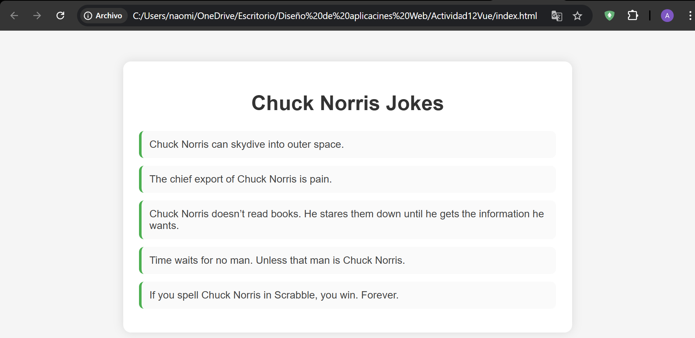

# Actividad 12 – Vue.js (Chuck Norris Jokes)
**Alumno:** Angel Barrios  
**Materia:** Diseño de Aplicaciones Web  

---

## 📌 Descripción  
Esta actividad consiste en crear una aplicación Vue.js simple que muestre una lista de chistes de Chuck Norris utilizando la directiva `v-for`.

---

## 📸 Evidencia  
A continuación se muestra la captura del funcionamiento de la aplicación:



---

## 🚀 Tecnologías Utilizadas
- HTML5  
- JavaScript (Vue.js 2 desde CDN)  
- CSS para diseño minimalista  

---

## 📂 Estructura del Proyecto
```
Actividad12Vue/
│── index.html
│── E1.png
│── README.md
```

---

## ▶ Cómo ejecutar
1. Abrir la carpeta del proyecto.  
2. Hacer doble clic en **index.html**.  
3. El navegador mostrará la aplicación sin necesidad de servidor.

---

## ✔ Cumplimiento de la actividad
- Instancia de Vue creada correctamente.  
- Lista mostrada con `v-for`.  
- Diseño limpio y minimalista.  
- Evidencia incluida.  

---

