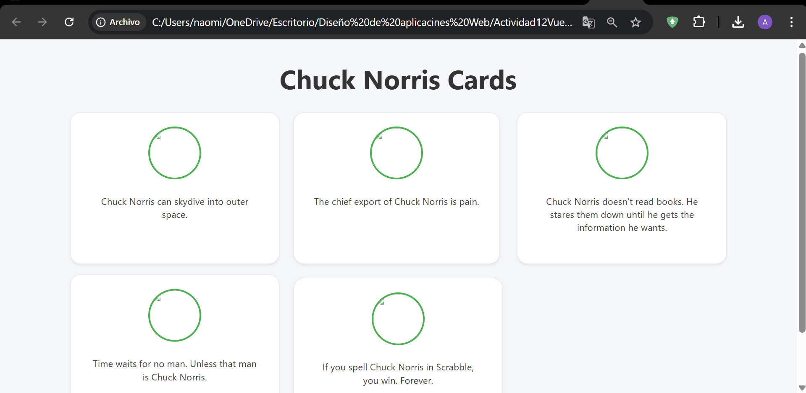

# Tarea 10 – Componentes en Vue con Bootstrap Cards  
**Alumno:** Angel Barrios  
**Materia:** Diseño de Aplicaciones Web  
**Profesor:** Leonardo Gadiel Mendoza Contreras  

---

## 📌 Descripción de la Actividad  
Esta actividad tiene como objetivo aplicar el uso de:

- Componentes en Vue.js  
- Props para enviar información entre componentes  
- Bootstrap para crear tarjetas responsivas  
- Arreglos de objetos que contienen iconos e información  
- Buenas prácticas de diseño

Partiendo de la Actividad 12, se modificó el arreglo de datos para incluir `icon_url` y `value`, y se construyó un componente llamado `<chuck-card>` basado en una tarjeta de Bootstrap.

---

## 📂 Estructura del Proyecto

```
Actividad12Vue/
│── index.html
│── app.js
│── chuck-card.js
│── style.css
│── E1.png
│── E2.png
│── README.md
```

---

## 🧩 Funcionalidad

### ✔ Componentes  
Se creó el componente `<chuck-card>` que recibe dos props:  
- `icon_url` → URL del icono del chiste  
- `value` → Texto del chiste  

### ✔ Diseño Responsive  
Se utilizaron clases de Bootstrap:  
- `col-lg-4` → 3 tarjetas por fila  
- `col-md-6` → 2 tarjetas por fila  
- `col-12` → 1 tarjeta en pantallas pequeñas  

### ✔ Estética Mejorada  
Se personalizó el diseño con estilos adicionales para dar una apariencia más moderna:

- Bordes redondeados  
- Avatar circular  
- Sombras suaves  
- Efecto hover profesional  

---

## 📸 Evidencia del Proyecto  

### Pantalla del resultado final  


---

## ▶ Cómo Ejecutarlo

1. Abrir la carpeta del proyecto  
2. Ejecutar **index.html** haciendo doble clic  
3. No requiere servidor ni instalación adicional  

---

## 📝 Cumplimiento de la Actividad

- Componente Vue → ✔  
- Uso de props → ✔  
- Bootstrap Card → ✔  
- Responsive: 3 y 2 tarjetas por fila → ✔  
- Subida a GitHub → ✔  

---

## 🚀 Autor  
**Angel Barrios**  
Universidad Tecmilenio  
